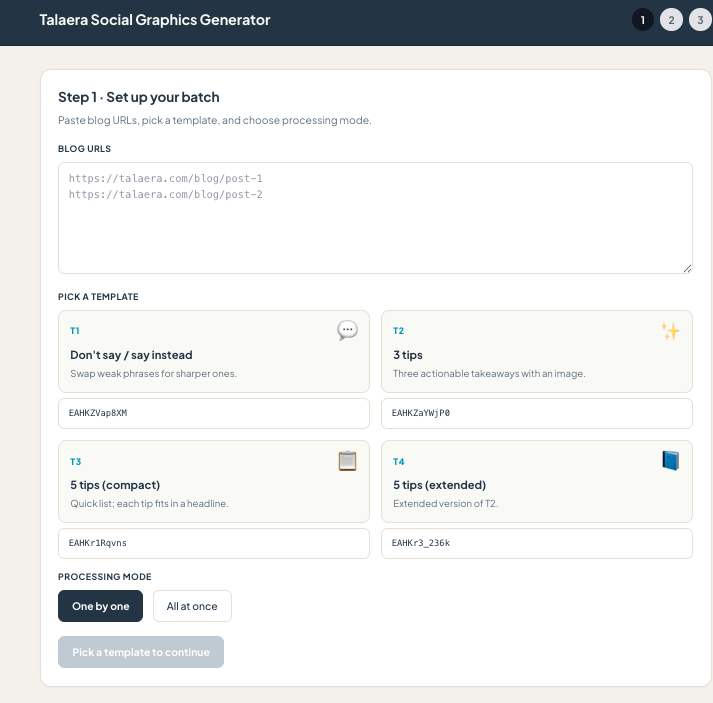
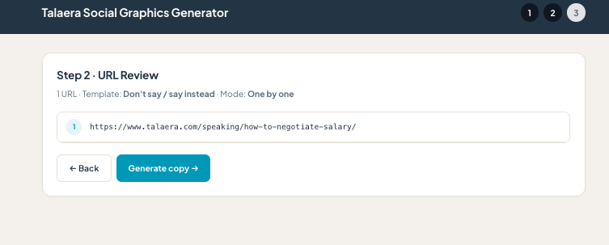
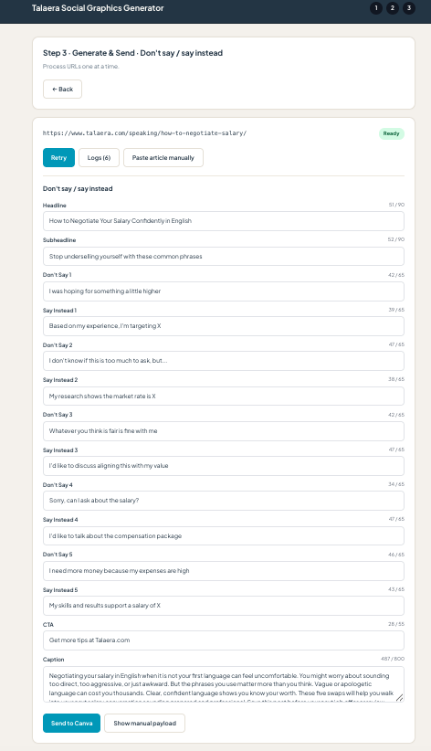
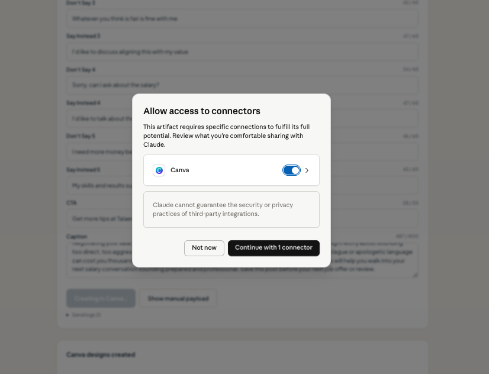
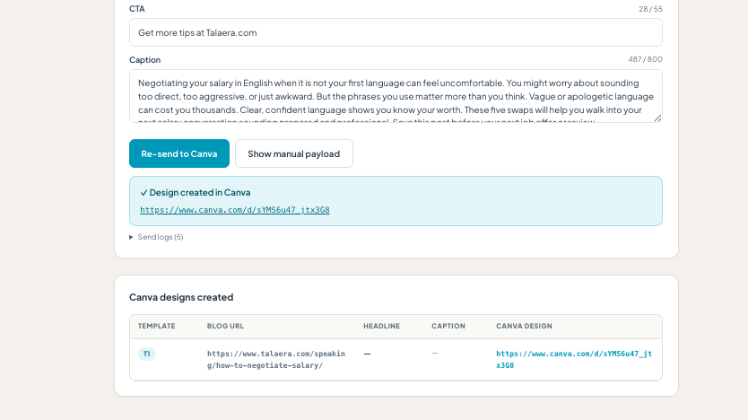

# AI Social Content Repurposing Engine

## Overview

I built this workflow to reduce the time required to turn blog content into publishable social media assets.

The system takes a blog URL, extracts the article, transforms the content into different social media formats, allows for human review and editing, and automatically creates Canva designs through a Canva MCP integration.

The goal was not to replace human judgment but to eliminate repetitive production work while keeping editorial control.

---

## The Problem

A single blog post often needs to become multiple social assets.

The manual workflow looked something like this:

- Read the article
- Extract key ideas
- Rewrite content for social
- Choose a visual format
- Copy everything into Canva
- Build the design
- Review and publish

The process was repetitive and time-consuming.

---

## The Solution

I designed a local AI-powered content operations workflow that:

1. Accepts one or multiple blog URLs
2. Extracts article content automatically
3. Applies specialized prompt templates
4. Generates structured social content
5. Allows human review and editing
6. Connects to Canva via MCP
7. Creates production-ready graphics

---

## Workflow

Blog URL

↓

Article Extraction

↓

Template Selection

↓

AI Content Transformation (Structured JSON)

↓

Human Review

↓

Canva MCP Autofill

↓

Final Design Generation

---

## Supported Content Formats

### Template 1
Don't Say This → Say This Instead

### Template 2
3 Tips

### Template 3
5 Tips (Compact)

### Template 4
5 Tips (Extended)

---

## AI Stack

- Claude Sonnet 4
- React
- TypeScript
- Prompt Engineering
- Canva MCP
- Human Review (in the loop)
- Structured JSON Outputs

---

## Skills Demonstrated

- AI workflow design
- Marketing automation
- Prompt engineering
- MCP integrations
- Human-in-the-loop systems
- Content operations
- Front-end prototyping
- AI-assisted content production

---

## Screenshots

### Setup screen

### URL review

### Content generation

### Canva MCP connector

### Canva design created

### Final social graphic

---

## Outcome

The workflow reduces the time required to transform long-form content into publishable social graphics while maintaining quality control and brand consistency.
---
## Business Impact

Before:
- Manual content repurposing
- Multiple copy/paste steps
- Canva production done manually

After:
- Automated extraction and transformation
- Structured outputs ready for review
- Canva design generation through MCP integration

Result:
- Reduced production time per asset
- Improved consistency across social formats
- Easier scaling of content repurposing
