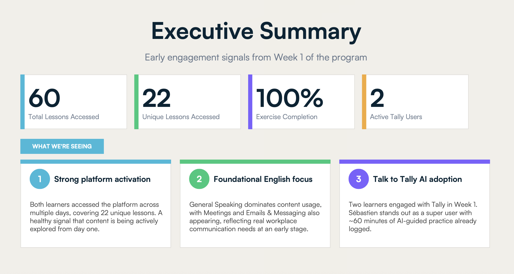
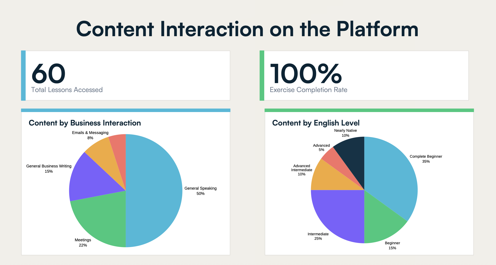
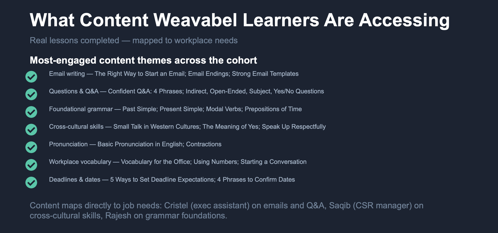

# AI Customer Success Intelligence Engine

A company-wide intelligence system that transforms learner engagement data into executive-ready impact reports, customer success insights, expansion opportunities, and business narratives.

## Overview

Customer success teams often spend hours manually pulling usage data, identifying patterns, building slides, and crafting narratives for pilot reviews, renewals, and executive business reviews.

This system connects Talaera learner data to Claude through MCP integrations and generates customer-facing reports tailored to specific business objectives.

## The Problem

Customer data exists across multiple systems and metrics.

Turning that information into a compelling business narrative requires significant manual effort and often leads to inconsistent reporting.

## The Solution

The workflow analyzes learner activity and engagement data, identifies meaningful patterns, and generates tailored reports based on the desired outcome.

Examples include:

- Pilot success reviews
- Renewal conversations
- Upsell opportunities
- Executive business reviews
- Engagement recovery plans
- Quarterly impact reports

## Inputs

- Learner engagement
- Learning platform activity
- AI coaching activity
- Business English Assessment results
- Speaking Club attendance
- In-app and email survey responses
- Communication Profile data
- Customer goals

## Intelligence Layer

The system identifies:

- Activation signals
- Power users
- At-risk learners
- Engagement trends
- Role-relevant learning patterns
- Content themes mapped to job needs
- Skill development opportunities
- Expansion opportunities
- Recommended next actions

## Outputs

- Executive impact reports
- Customer success summaries
- Renewal narratives
- Expansion recommendations
- Stakeholder presentations
- QBR decks

## Operational Workflow

The system does more than generate reports. It combines data retrieval, narrative generation, asset creation, and knowledge sharing into a single workflow.

Capabilities include:

- Pulling learner and engagement data directly from Talaera systems via MCP integrations
- Generating reports tailored to specific business objectives (pilot reviews, renewals, upsells, engagement recovery, executive reviews)
- Applying standardized Talaera report structures and branding
- Creating presentation-ready slide decks from approved templates
- Automatically uploading completed reports to shared company folders
- Maintaining visibility across Customer Success, Sales, Account Management, and Marketing teams
- Creating a centralized source of customer intelligence accessible across departments

## Human Oversight

Recommendations and business narratives remain subject to customer success review before being shared externally.

## What Makes This Different

This workflow goes beyond aggregating platform data.

It interprets learner behavior in context and connects usage patterns to business value.

For example, the system can identify that:
- An executive assistant engaging with email and Q&A content signals role-relevant skill development
- A CSR manager practicing cross-cultural communication signals applied workplace relevance
- A learner focused on grammar foundations may be building core confidence before moving into higher-stakes communication practice

The goal is to translate product activity into a narrative that customer stakeholders can understand and act on.

## Organizational Impact

The workflow was designed as a company-wide capability rather than a single-team tool.

Teams using the system include:

- Customer Success
- Account Management
- Sales
- Marketing

This allows customer insights, engagement trends, and learner behavior data to be consistently interpreted and shared across the organization.

Instead of multiple teams creating reports independently, the workflow creates a standardized intelligence layer that supports customer conversations, expansion opportunities, renewal discussions, and marketing initiatives.

## Screenshots

### Executive summary

### Content mapped to workplace needs

### Platform engagement snapshot

