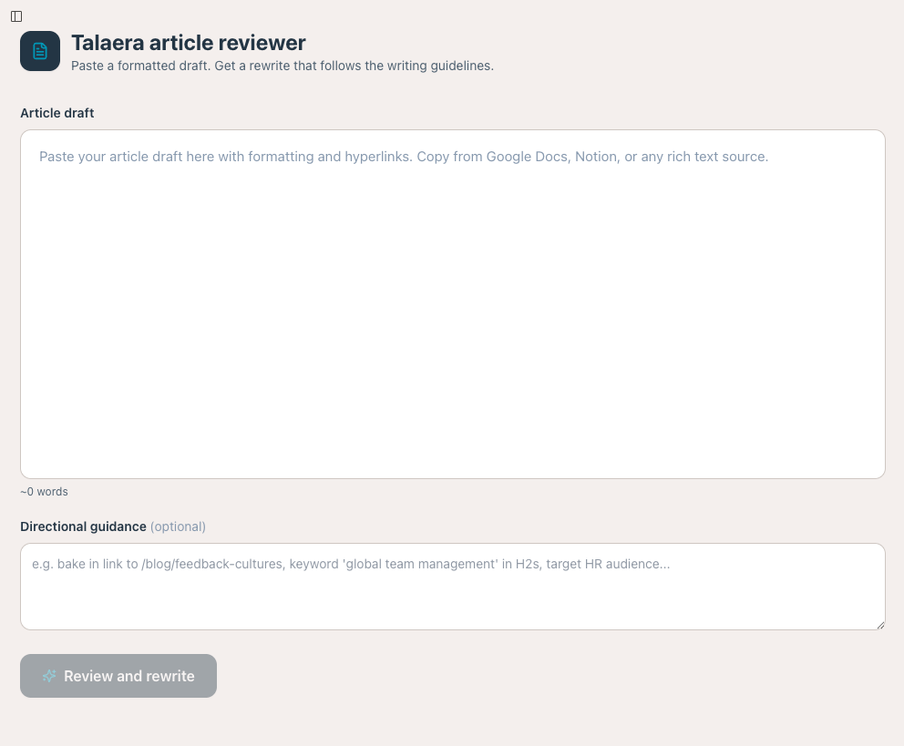

# AI Editorial Review Engine

An internal AI-powered review tool that turns article drafts into publication-ready content by applying a detailed editorial framework across brand voice, structure, SEO, readability, linking, and AI-search visibility.

## Overview

I built this tool as the quality-control layer of my broader **AI Content Operations & Intelligence Platform**.

The main platform supports the full content lifecycle, from keyword research and competitive analysis to drafting, publishing, performance monitoring, and automated content audits. Once an article draft has been created, the AI Editorial Review Engine runs a second, more rigorous review before publication.

Its purpose is to make editorial quality repeatable. Instead of relying on an editor to remember every writing rule, SEO requirement, brand guideline, and formatting standard, the system applies the same framework to every draft and explains the changes it makes.

## The problem

AI can speed up content production, but faster output does not automatically mean better content.

Drafts can still contain vague language, repetitive sentence structures, weak section openings, inconsistent formatting, generic headings, poor internal linking, and patterns that make the writing feel obviously AI-generated. These issues become harder to catch when content is produced by several writers, subject matter experts, freelancers, or AI workflows.

Manual review also creates a bottleneck. The editor has to check the same standards repeatedly, and the quality of the final article can depend on how much time is available for that review.

## The solution

The AI Editorial Review Engine converts a formatted article into markdown and sends it through a structured editorial review workflow powered by Claude.

The system preserves the original wording wherever possible while rewriting anything that conflicts with the editorial framework. It then produces two outputs:

1. A revised article in publication-ready markdown
2. A detailed changelog explaining the structural, stylistic, linking, and citation-related changes

The user can also add article-specific guidance, such as the target audience, primary keyword, internal pages to reference, or sections that need additional attention.




## How the workflow works

```text
Formatted article draft
        ↓
HTML cleaning and rich-text processing
        ↓
Markdown conversion
        ↓
Article-specific user guidance
        ↓
Editorial framework and business rules
        ↓
Claude review and rewrite
        ↓
Publication-ready article
        +
Detailed editorial changelog
```

The application streams the revised article as it is generated, allowing the user to follow the review in real time. Once complete, the article and changelog are displayed separately so the final copy remains easy to review and export.

## Editorial framework

The system evaluates each article across several connected areas.

### Brand voice and writing quality

It checks whether the writing sounds clear, experienced, specific, and natural. It removes vague corporate language, weak modifiers, unnecessary complexity, and common AI-generated writing patterns.

It also enforces sentence and paragraph standards, including varied sentence rhythm, active voice, natural contractions, focused paragraphs, and stronger section openings.

### Content structure

The tool reviews heading hierarchy, section length, paragraph structure, bullet usage, introductions, conclusions, and FAQs.

Each section must open with its central point rather than a long setup. Headings must communicate specific meaning, and the article must follow a logical hierarchy without skipping heading levels.

### SEO and internal linking

The review preserves existing links and identifies opportunities to add relevant internal Talaera links. When a verified URL is unavailable, it marks a suggested topic so the editor can replace it before publishing.

It also checks whether headings, FAQs, definitions, and section structure support search intent without forcing keywords into unnatural places.

### AI-search visibility

The framework includes rules designed to make content easier for AI systems to understand and cite.

The tool introduces short, self-contained definitions and pattern statements that can be understood outside the surrounding paragraph. It also reviews whether the article uses clear semantic headings, direct answers, useful FAQs, and citation-ready language.

### Evidence and attribution

The system can use approved internal data when it fits the topic and can search for external sources when a claim would benefit from supporting evidence.

Internal statistics must use clear attribution, such as “According to Talaera platform data” or “Among Talaera learners.”

## Key capabilities

* Accepts formatted content copied from Google Docs, Notion, or other rich-text sources
* Removes unsafe or unnecessary HTML before processing
* Converts headings, lists, links, quotes, bold text, and italics into markdown
* Preserves existing hyperlinks throughout the rewrite
* Applies a detailed editorial and brand framework
* Supports custom guidance for individual articles
* Reviews content structure, readability, SEO, and AI-search visibility
* Adds or suggests internal and external linking opportunities
* Produces rewritten content and a separate audit trail
* Streams results in real time
* Supports stopping, retrying, rerunning, and copying the final markdown
* Automatically retries the API request once after a failed response

## Change log

Every completed review includes a structured change log covering:

* Structural changes
* Style and vocabulary fixes
* LLM-optimized citable statements
* Hyperlink changes and recommendations
* Statistics and citations
* Original content that was preserved

This makes the AI's work easier to audit. The editor can see what changed, understand why it changed, and decide whether to accept or adjust the recommendation.

## Technology

* React
* JavaScript
* Claude Sonnet
* Anthropic Messages API
* Anthropic web search
* Streaming API responses
* HTML-to-Markdown processing
* Prompt architecture
* Editorial rule systems
* Human-in-the-loop content review

## Business value

The engine reduces the amount of repetitive work required during the final editorial review while increasing consistency across articles.

It creates a shared publishing standard that can be applied to AI-generated drafts, freelancer submissions, internal writing, and subject matter expert contributions. This allows content production to scale without lowering the quality threshold or making every article dependent on one person's memory of the style guide.

The project also shows how a subjective process can be converted into an operational system. Editorial judgment still matters, but the repetitive checks are handled automatically so the human editor can focus on accuracy, insight, originality, and strategic relevance.

## Role within the content operating system

This project does not generate the initial content strategy or replace the wider content workflow.

It sits after the drafting stage and before publication:

```text
Keyword and opportunity research
        ↓
Competitive and search analysis
        ↓
Content brief and article generation
        ↓
AI Editorial Review Engine
        ↓
Human approval and publishing
        ↓
Performance monitoring
        ↓
Automated content health audits
```

Together, these workflows form a scalable content operating system that connects strategy, production, quality control, publishing, and performance intelligence.
